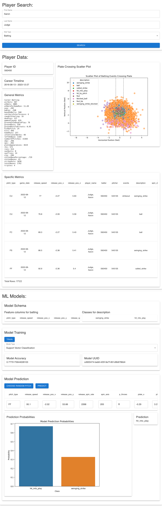

# MLB_Metrics_DS

Python-based backend API for MLB metrics and React-based frontend project using this API.

## Python Backend

The Flask backend at [mlb_metrics_backend/flask_backend.py](mlb_metrics_backend/flask_backend.py) has functionality for:

- Retrieving a baseball player's API ID based on their name and player number
- Obtaining general metrics for a player using their ID
- Generating a player's career timeline based on general metrics
- Fetching specific metrics for a player within a given time range
- Processing data for plate crossing metrics
- Handling model data for pitching and batting analysis
- Generating plots for player metrics
- Testing models with provided data and returning model accuracy
- Making predictions using a trained model and feature data

The functions are defined in [mlb_metrics_backend/mlb_metrics_helpers.py](mlb_metrics_backend/mlb_metrics_helpers.py).
Examples for their use are included in [mlb_metrics_backend/helpers_example.ipynb](helpers_example.ipynb).

## React Frontend

The React frontend at [example_react_project/src](example_react_project/src) has functionality for:

- Searching for baseball player metrics by first name, last name, and metric type (`pitching` or `batting`)
- Displaying the following player data:
    - API Player ID
    - Career Timeline
    - General Metrics
    - Specific Metrics
    - Plate Crossing Scatter Plot
- Developing and testing machine learning models:
    - model schema (depends on metric type)
    - model training (choose from 5 sklearn models)
    - model predictions (given pitch data)

## Usage

### Step 1: Run Flask Backend

#### Step 1a: Use Conda Environment

1) Follow steps at https://docs.anaconda.com/free/anaconda/install/index.html to install.
2) Create `mlb_metrics_backend` environment with
```sh
conda env create -f mlb_metrics_backend/mlb_metrics_backend_env.yml
```
3) Activate `mlb_metrics_backend` environment with
```sh
conda activate mlb_metrics_backend
```

#### Step 1b: Start Flask Backend

1) Start `flask_backend.py` with
```sh
python mlb_metrics_backend/flask_backend.py
```
2) Note url where Flask app is running (ex `http://127.0.0.1:5000`)

### Step 2: Run React Project

#### Step 2a: Install Package Managers

Follow steps at https://docs.npmjs.com/downloading-and-installing-node-js-and-npm to install Node.js and npm.

#### Step 2b: Install Dependencies

Install dependencies with
```sh
cd example_react_project/
npm install
```

#### Step 2c: Start React Project

Start React project with
```sh
cd example_react_project/
npm start
```

Note: You may need to change the `API_URL` in [example_react_project/src/App.js](example_react_project/src/App.js) to reflect the url where Flask app is running (from step 1b).

## Preview

### Pitching Preview


### Batting Preview

